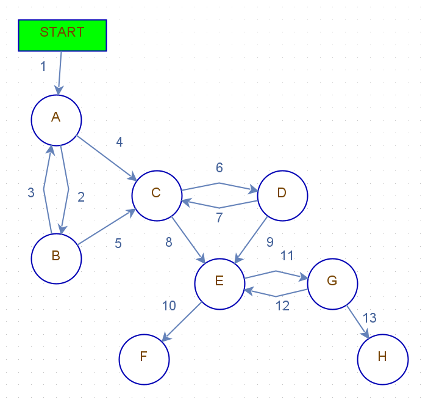

# Domácí úkol 6

| Větvící bod | původ           | původní název                    |
| ----------- | --------------- | -------------------------------- |
| A           | rozhodovací bod | slevový kupon                    |
| B           | rozhodovací bod | kontrola kuponu                  |
| C           | rozhodovací bod | sleva na věk                     |
| D           | rozhodovací bod | kontrola podmínek                |
| E           | rozhodovací bod | metoda platby                    |
| F           | koncový stav    | po "Vystavení údajů pro převod"  |
| G           | rozhodovací bod | platba úspěšná/neúspěšná         |
| H           | koncový stav    | platba úspěšná                   |

## TDL=1

Větvící bod | Výstupy
------------|--------
A           | 1, 3
B           | 2
C           | 4, 5, 7
D           | 6
E           | 8, 9, 12
F           | 10
G           | 11
H           | 13

### TDL=1 Průchody

- 1, 2, 3, 4, 6, 7, 8, 11, 12, 10
- 1, 2, 5, 6, 9, 11, 13

## TDL=2

Větvící bod | Vstupy   | Výstupy | Kombinace
------------|----------|---------|--------------------------------------
A           | 1        | 2, 4    | 1-2, 1-4, 3-2, 3-4
B           | 2        | 3, 5    | 2-3, 2-5
C           | 4, 5, 7  | 6, 8    | 4-6, 4-8, 5-6, 5-8, 7-6, 7-8
D           | 6        | 7, 9    | 6-7, 6-9
E           | 8, 9, 12 | 10, 11  | 8-10, 8-11, 9-10, 9-11, 12-10, 12-11
G           | 11       | 12, 13  | 11-12, 11-13

### TDL=2 Průchody

- 1, 4, 8, 10
- 1, 2, 3, 2, 5, 6, 7, 8, 11, 13
- 1, 2, 3, 4, 6, 7, 6, 9, 10
- 1, 2, 5, 8, 11, 12, 10
- 1, 2, 5, 6, 9, 11, 12, 11, 13

## TDL=3

[CSV soubor](TS1-HW6-TDL3.csv)
